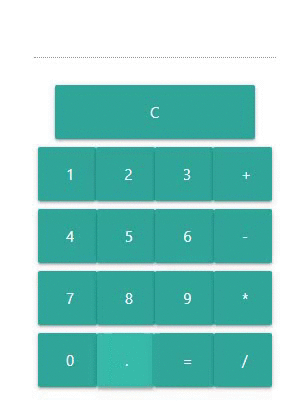

# Calculator
Simple calculator

## Getting Started

These instructions will get you a copy of the project up and running on your local machine for development and testing purposes. 

### Tech
Technologies used in project

- JavaScript
- Webpack
- Sass
- HTML
- Materialize


### Instaling

Download or clone project

```
git clone https://github.com/vladosxxx/calculator.git
```
Then go to folder project 
```
cd calculator
```
To develop run
```
npm run start:dev
```
### Preview
 

License
----

MIT